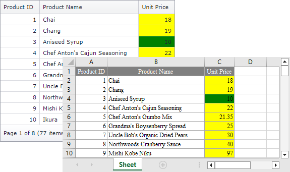

<!-- default badges list -->

[](https://supportcenter.devexpress.com/ticket/details/T334596)
[](https://docs.devexpress.com/GeneralInformation/403183)
<!-- default badges end -->

# Grid View for MVC - How to export a colored grid in WYSIWYG export mode
<!-- run online -->
**[[Run Online]](https://codecentral.devexpress.com/t334596/)**
<!-- run online end -->

This example shows how to color the exported grid when the WYSIWYG export mode is used.



The grid does not export cell styles applied in the [HtmlDataCellPrepared](https://docs.devexpress.com/AspNetMvc/DevExpress.Web.Mvc.GridViewSettings.HtmlDataCellPrepared) event. 

To color the exported grid in WYSIWYG export mode, handle the [GridViewSettings.SettingsExport.RenderBrick](https://docs.devexpress.com/AspNetMvc/DevExpress.Web.Mvc.MVCxGridViewExportSettings.RenderBrick?p=netframework) event.

```cs
settings.SettingsExport.RenderBrick = (sender, e) => {
    if(e.RowType != GridViewRowType.Data)
        return;
    if((e.Column as GridViewDataColumn).FieldName == "UnitPrice" && e.RowType != GridViewRowType.Header) {
        if(Convert.ToInt32(e.TextValue) > 15)
            e.BrickStyle.BackColor = System.Drawing.Color.Yellow;
        else
            e.BrickStyle.BackColor = System.Drawing.Color.Green;
    }
};
```


> **Note**
> Starting with v15.2, the grid maintains conditional formatting styles in the exported document. You can use the [GridViewSettings.FormatConditions](https://docs.devexpress.com/AspNetMvc/DevExpress.Web.Mvc.GridViewSettings-1.FormatConditions) rules to define conditional formatting in browse mode and keep the applied appearance in the exported document.

## Files to Review

* [HomeController.cs](./CS/Controllers/HomeController.cs#L54-63) (VB: [HomeController.vb](./VB/Controllers/HomeController.vb))
* [Model.cs](./CS/Models/Model.cs) (VB: [Model.vb](./VB/Models/Model.vb))
* [GridViewPartialProducts.cshtml](./CS/Views/Home/GridViewPartialProducts.cshtml)
* [Index.cshtml](./CS/Views/Home/Index.cshtml)

## Documentation

* [Export Grid View Data](https://docs.devexpress.com/AspNet/3791/components/grid-view/concepts/export)

## Technical Demos

* [Grid View - Export with Format Conditions](https://demos.devexpress.com/MVCxGridViewDemos/Exporting/ExportWithFormatConditions)
## More Examples

* [Grid View for MVC - How to export a colored grid in Data Aware export mode](todoaspxgridview-how-to-export-a-colored-grid-when-the-data-aware-export-mode-is-used-t262239)
